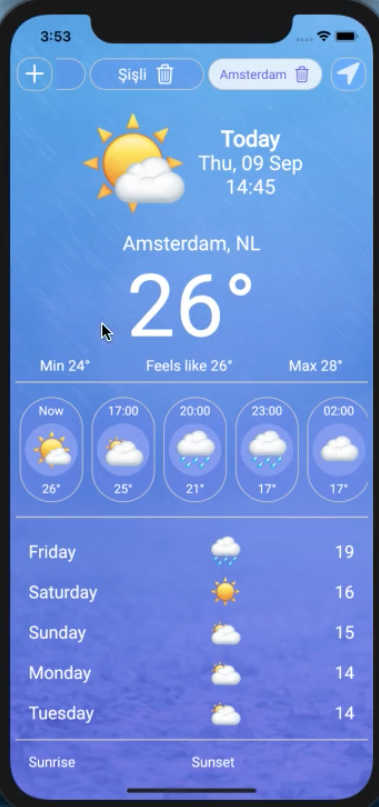

# weather_me_flutter

A new Flutter application.

<br>
<a href="http://resume.alperkurtul.com/wp-content/uploads/2021/09/weather-me.mp4" target="_blank">Demo Video</a><br>
<a href="http://resume.alperkurtul.com/wp-content/uploads/2021/09/weather-me.mp4" target="_blank">Demo Video</a><br>

## Getting Started

This project is a starting point for a Flutter application.

A few resources to get you started if this is your first Flutter project:

- [Lab: Write your first Flutter app](https://flutter.dev/docs/get-started/codelab)
- [Cookbook: Useful Flutter samples](https://flutter.dev/docs/cookbook)

For help getting started with Flutter, view our
[online documentation](https://flutter.dev/docs), which offers tutorials,
samples, guidance on mobile development, and a full API reference.

## Output of 'flutter doctor'
```
[✓] Flutter (Channel stable, 1.22.6, on Mac OS X 10.15.7 19H114 darwin-x64, locale en-TR)

[!] Android toolchain - develop for Android devices (Android SDK version 29.0.2)
    ! Some Android licenses not accepted.  To resolve this, run: flutter doctor --android-licenses
[✓] Xcode - develop for iOS and macOS (Xcode 12.2)
[!] Android Studio (version 4.1)
    ✗ Flutter plugin not installed; this adds Flutter specific functionality.
    ✗ Dart plugin not installed; this adds Dart specific functionality.
[✓] IntelliJ IDEA Ultimate Edition (version 2020.3)
[!] IntelliJ IDEA Community Edition (version 2020.3)
    ✗ Flutter plugin not installed; this adds Flutter specific functionality.
    ✗ Dart plugin not installed; this adds Dart specific functionality.
[✓] VS Code (version 1.54.1)
[✓] Connected device (1 available)

! Doctor found issues in 3 categories.
```

## pubsbec.yaml

```
name: weather_me_flutter
description: A new Flutter application.

publish_to: 'none' # Remove this line if you wish to publish to pub.dev

version: 1.0.0+1

environment:
  sdk: ">=2.7.0 <3.0.0"

dependencies:
  flutter:
    sdk: flutter

  cupertino_icons: ^1.0.0
  provider: ^4.3.3
  http: ^0.12.2
  shared_preferences: ^0.5.12+4
  geolocator: ^6.2.0
  flutter_spinkit: ^4.1.2
  visibility_detector: ^0.1.5

dev_dependencies:
  flutter_test:
    sdk: flutter

flutter:

  uses-material-design: true

  assets:
    - assets/background.jpg

  fonts:
    - family: Pacifico
      fonts:
        - asset: fonts/Pacifico-Regular.ttf

    - family: Source Sans Pro
      fonts:
        - asset: fonts/SourceSansPro-Regular.ttf

    - family: Roboto
      fonts:
        - asset: fonts/Roboto-Regular.ttf
```

## ANDROID Settings
```
/android/app/build.gradle
  - applicationId "com.alperkurtul.weather_me"  ==> CHANGE THIS LINE
```

```
/android/app/src/debug/AndroidManifest.xml
  - <manifest xmlns:android="http://schemas.android.com/apk/res/android"
    package="com.alperkurtul.weather_me">  ==> CHANGE THIS LINE
```

```
/android/app/src/main/AndroidManifest.xml
  - <manifest xmlns:android="http://schemas.android.com/apk/res/android"
    package="com.alperkurtul.weather_me">  ==> CHANGE THIS LINE
  - <uses-permission android:name="android.permission.INTERNET"/>  ==> ADD THIS LINE
    <uses-permission android:name="android.permission.ACCESS_COARSE_LOCATION" />  ==> ADD THIS LINE
    <uses-permission android:name="android.permission.ACCESS_BACKGROUND_LOCATION" />  ==> ADD THIS LINE
    <application
        android:name="io.flutter.app.FlutterApplication"
        android:label="Weather ME"  ==> CHANGE THIS LINE
        android:icon="@mipmap/ic_launcher">
```

```
/android/app/src/main/ic_launcher-playstore.png  ==> COPY THIS
```

```
/android/app/src/main/kotlin/com/example/weather_me_flutter/MainActivity.kt
  - package com.alperkurtul.weather_me  ==> CHANGE THIS LINE
```

```
/android/app/src/main/res/drawable*  ==> COPY THESE
/android/app/src/main/res/mipmap*  ==> COPY THESE
/android/app/src/main/res/values/colors.xml  ==> ADD THIS
```

```
/android/app/src/profile/AndroidManifest.xml
  - <manifest xmlns:android="http://schemas.android.com/apk/res/android"
    package="com.example.weather_me_flutter">    ==> NOT SURE TO CHANGE THIS LINE
```

## iOS Settings

```
/ios/Runner/Info.plist
  - <key>CFBundleName</key>
	<string>Weather ME</string>  ==> CHANGE THIS LINE
	<key>CFBundlePackageType</key>
	<string>APPL</string>
	<key>CFBundleShortVersionString</key>
	<string>$(FLUTTER_BUILD_NAME)</string>
	<key>CFBundleSignature</key>
	<string>????</string>
	<key>CFBundleVersion</key>
	<string>$(FLUTTER_BUILD_NUMBER)</string>
	<key>LSRequiresIPhoneOS</key>
	<true/>
	<key>NSLocationAlwaysUsageDescription</key>  ==> ADD THIS LINE
	<string>This app needs access to location when in the background.</string>  ==> ADD THIS LINE
	<key>NSLocationWhenInUseUsageDescription</key>  ==> ADD THIS LINE
	<string>This app needs access to location when open.</string>  ==> ADD THIS LINE
	<key>UILaunchStoryboardName</key>
	<string>LaunchScreen</string>
```

```
/ios/Runner/Assets.xcassets/AppIcon.appiconset  ==> COPY THESE
/ios/Runner/Assets.xcassets/LaunchImage.imageset  ==> COPY THESE
```

```
XCODE ==> Runner ==> General
  - Display Name : Weather ME
  - Bundle Identifier : com.alperkurtul.weatherMe
```

## SPLASH Page Background Color

`#5A73EF`